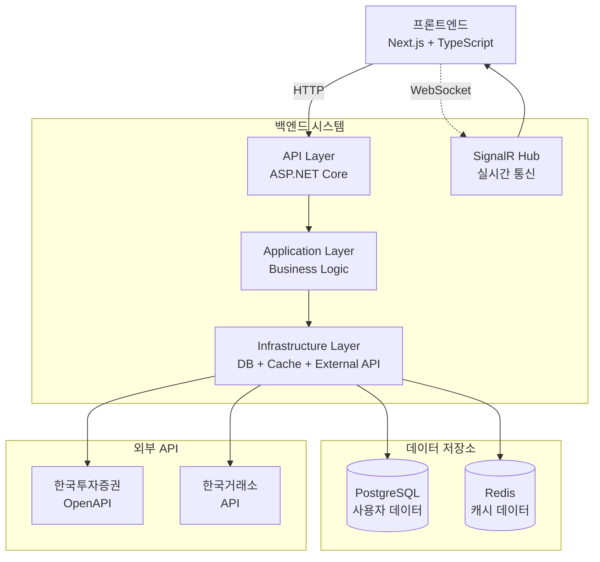

# 📈 실시간 주식 거래 시스템

> 한국투자증권 OpenAPI 연동 실시간 주식 거래 플랫폼

[](https://dotnet.microsoft.com/)
[](https://postgresql.org/)
[](https://dotnet.microsoft.com/apps/aspnet/signalr)
[](https://blog.cleancoder.com/uncle-bob/2012/08/13/the-clean-architecture.html)

[🔗 서비스 데모](https://happy-glacier-0243a741e.6.azurestaticapps.net) | [🎨 프론트엔드 저장소](https://github.com/Yeongdong/stock-trading-frontend)

## 🎯 프로젝트 개요

**실시간 주식 트레이딩 시스템**은 한국투자증권 OpenAPI와 연동하여 실시간 주식 거래, 포트폴리오 관리, 시장 데이터 분석 기능을 제공하는 금융 거래 플랫폼입니다.

### 주요 특징

- **실제 증권사 API 연동**: 한국투자증권 OpenAPI 직접 연동
- **실시간 데이터 처리**: SignalR을 통한 실시간 주가 스트리밍
- **Clean Architecture**: 계층별 의존성 분리 및 테스트 용이성 확보
- **고성능 캐싱**: Redis + 메모리 캐시 다층 구조로 응답 속도 최적화

## 🏗️ 시스템 아키텍처

### Clean Architecture 계층 구조

```
┌─────────────────────────────────────────────┐
│           🌐 API Layer (ASP.NET)            │
│     Controllers, SignalR Hubs, Middleware   │
├─────────────────────────────────────────────┤
│           📋 Application Layer              │
│      Services, DTOs, UseCases, Validators   │
├─────────────────────────────────────────────┤
│          🏗 Infrastructure Layer            │
│   Repositories, External APIs, Cache, DB    │
├─────────────────────────────────────────────┤
│              💼 Domain Layer                │
│     Entities, ValueObjects, Enums, Rules    │
└─────────────────────────────────────────────┘
```

### 시스템 구성도



## 🛠 기술 스택

| 분류            | 기술                    | 버전    | 용도          |
|---------------|-----------------------|-------|-------------|
| **Framework** | ASP.NET Core          | 8.0   | 웹 API 프레임워크 |
| **Language**  | C#                    | 12    | 프로그래밍 언어    |
| **Database**  | PostgreSQL            | 16    | 관계형 데이터베이스  |
| **ORM**       | Entity Framework Core | 8.0   | 데이터베이스 접근   |
| **Cache**     | Redis                 | 분산 캐시 | 성능 최적화      |
| **Real-time** | SignalR               | 8.0   | 실시간 통신      |

## 📁 프로젝트 구조

```
StockTrading/
├── StockTrading.API/                    # API 진입점
│   ├── Controllers/                     # REST API 컨트롤러
│   ├── Hubs/                           # SignalR 허브
│   ├── Middlewares/                    # 미들웨어 (인증, 로깅, 예외처리)
│   └── Program.cs                      # 애플리케이션 진입점
│
├── StockTrading.Application/            # 애플리케이션 계층
│   ├── Services/                       # 비즈니스 서비스 인터페이스
│   ├── DTOs/                          # 데이터 전송 객체
│   ├── Features/                      # 기능별 유즈케이스
│   │   ├── Auth/                      # 인증 관련
│   │   ├── Market/                    # 시장 데이터
│   │   ├── Trading/                   # 거래 관련
│   │   └── Users/                     # 사용자 관리
│   └── ExternalServices/              # 외부 서비스 인터페이스
│
├── StockTrading.Infrastructure/         # 인프라스트럭처 계층
│   ├── Data/                          # 데이터베이스 컨텍스트
│   ├── Repositories/                  # 데이터 접근 구현체
│   ├── ExternalServices/              # 외부 서비스 구현
│   │   └── KoreaInvestment/          # 한국투자증권 API 클라이언트
│   │       ├── Common/               # 공통 기능
│   │       ├── Market/               # 시장 데이터 API
│   │       ├── Trading/              # 거래 API
│   │       └── RealTime/             # 실시간 데이터
│   └── Configurations/                # DI 설정 및 구성
│
├── StockTrading.Domain/                 # 도메인 계층
│   ├── Entities/                      # 핵심 엔티티
│   ├── ValueObjects/                  # 값 객체
│   ├── Enums/                        # 열거형
│   ├── Exceptions/                   # 도메인 예외
│   └── Settings/                     # 설정 모델
│
└── StockTrading.Tests/                  # 테스트
├── Unit/                          # 단위 테스트
├── Integration/                   # 통합 테스트
└── TestHelpers/                  # 테스트 헬퍼
```

## 🚀 주요 API 엔드포인트

### 인증 관련 API

```http
POST   /api/auth/google              # Google OAuth 로그인
POST   /api/auth/refresh             # JWT 토큰 갱신
GET    /api/auth/profile             # 사용자 프로필 조회
```

### 시장 데이터 API

```http
GET    /api/market/stocks/search            # 주식 종목 검색
GET    /api/market/stocks/{stockCode}       # 종목 상세 정보
GET    /api/market/stocks/overseas/search   # 해외 주식 검색
GET    /api/market/stocks/overseas/markets/{market} # 시장별 종목 조회
```

### 거래 관련 API

```http
POST   /api/trading/orders                  # 주문 생성
GET    /api/trading/balance                 # 계좌 잔고 조회
GET    /api/trading/buyable-inquiry         # 매수 가능 금액 조회
GET    /api/trading/executions              # 체결 내역 조회
```

## ⚡ 핵심 기술 구현

### **1. Clean Architecture 의존성 관리**

**의존성 역전 원칙(DIP)** 을 통한 계층 간 느슨한 결합 구현

```csharp
// Application Layer - 서비스 인터페이스 정의
public interface IStockService
{
    Task<StockSearchResponse> SearchStocksAsync(string searchTerm, int page, int pageSize);
    Task<StockDetails?> GetStockDetailsAsync(string stockCode);
}

// Infrastructure Layer - 구현체
public class StockService : IStockService
{
    private readonly IStockRepository _repository;
    private readonly IStockCacheService _cacheService;

    public async Task<StockDetails?> GetStockDetailsAsync(string stockCode)
    {
        // 캐시 우선 조회
        var cached = await _cacheService.GetStockDetailsAsync(stockCode);
        if (cached != null) return cached;

        // DB 조회 후 캐싱
        var result = await _repository.GetByCodeAsync(stockCode);
        if (result != null)
            await _cacheService.SetStockDetailsAsync(stockCode, result);

        return result;
    }
}
```

### **2. 실시간 데이터 스트리밍 (SignalR)**

안정적인 실시간 주가 데이터 브로드캐스팅과 연결 상태 관리 구현

```csharp
// SignalR Hub - 실시간 통신 허브
[Authorize]
public class StockHub : Hub
{
    public override async Task OnConnectedAsync()
    {
        var userEmail = Context.User?.FindFirst(ClaimTypes.Email)?.Value;
        _logger.LogInformation("사용자 연결: {UserEmail}", userEmail);
        await base.OnConnectedAsync();
    }

    // 연결 상태 확인
    public async Task CheckConnection()
    {
        var connectionInfo = new
        {
            connectionId = Context.ConnectionId,
            userEmail = Context.User?.FindFirst(ClaimTypes.Email)?.Value,
            timestamp = DateTime.UtcNow
        };
        await Clients.Caller.SendAsync("ConnectionStatus", connectionInfo);
    }
}
```

### 3. 한국투자증권 API 연동

실제 금융 API와의 안정적인 연동 및 에러 처리

```csharp
// KIS API 클라이언트 베이스 클래스
public abstract class KisApiClientBase
{
    protected readonly HttpClient _httpClient;
    protected readonly KoreaInvestmentSettings _settings;

    protected async Task<T> SendRequestAsync<T>(HttpRequestMessage request)
    {
        var response = await _httpClient.SendAsync(request);
        response.EnsureSuccessStatusCode();
        
        var content = await response.Content.ReadAsStringAsync();
        return JsonSerializer.Deserialize<T>(content);
    }
}

// 잔고 조회 API 클라이언트
public class KisBalanceApiClient : KisApiClientBase, IKisBalanceApiClient
{
    public async Task<AccountBalance> GetStockBalanceAsync(UserInfo user)
    {
        var queryParams = CreateBalanceQueryParams(user);
        var httpRequest = CreateBalanceHttpRequest(queryParams, user);
        
        var kisResponse = await SendRequestAsync<KisBalanceResponse>(httpRequest);
        return CreateAccountBalance(kisResponse);
    }
}
```

### 4. 다층 캐싱 전략 구현

L1(메모리) + L2(Redis) 캐시로 성능 최적화

```csharp
// 캐시 서비스 구현
public class StockCacheService : IStockCacheService
{
    private readonly IDistributedCache _distributedCache; // Redis (L2)
    private readonly IMemoryCache _memoryCache;           // Memory (L1)

    public async Task<StockSearchResponse?> GetSearchResultAsync(string searchTerm, int page, int pageSize)
    {
        var cacheKey = GenerateCacheKey("search", searchTerm, page, pageSize);
        
        // L1 캐시 확인 (메모리)
        if (_memoryCache.TryGetValue(cacheKey, out StockSearchResponse? memoryResult))
            return memoryResult;

        // L2 캐시 확인 (Redis)
        var distributedData = await _distributedCache.GetStringAsync(cacheKey);
        if (!string.IsNullOrEmpty(distributedData))
        {
            var redisResult = JsonSerializer.Deserialize<StockSearchResponse>(distributedData);
            _memoryCache.Set(cacheKey, redisResult, TimeSpan.FromMinutes(5));
            return redisResult;
        }

        return null;
    }
}
```

## 📊 성능 최적화 결과

| 메트릭         | Before | After | 개선율       |
|-------------|--------|-------|-----------|
| 주식 검색 응답 시간 | 200ms  | 15ms  | **92% ↓** |
| 캐시 히트율      | -      | 85%   | **신규**    |
| API 에러율     | 5%     | 0.1%  | **98% ↓** |

## 🧪 테스트 구성

### 테스트 예시

```csharp
// 단위 테스트 - 서비스 레이어
public class StockServiceTests
{
    private readonly Mock<IStockRepository> _mockRepository;
    private readonly StockService _service;

    [Fact]
    public async Task GetStockDetailsAsync_ValidCode_ReturnsStockDetails()
    {
        // Arrange
        var stockCode = "005930";
        var expectedStock = new Stock { Code = stockCode, Name = "삼성전자" };
        _mockRepository.Setup(x => x.GetByCodeAsync(stockCode))
                      .ReturnsAsync(expectedStock);

        // Act
        var result = await _service.GetStockDetailsAsync(stockCode);

        // Assert
        result.Should().NotBeNull();
        result.Code.Should().Be(stockCode);
    }
}
```

---

## 📞 문의사항

- **개발자**: 정영동  
- **이메일**: jyd37855@gmail.com  
- **GitHub**: [@Yeongdong](https://github.com/Yeongdong)
